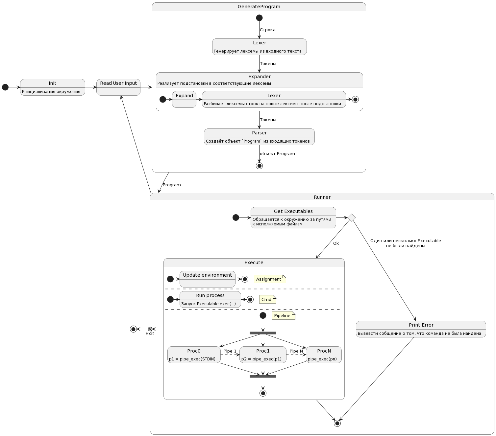

## Bash
### Команда: 
- Анеля Дусаева 
- Артемий Лазарев

### Aнализ:

Последовательность действий: 
Ввод пользователя -> Лексер -> Парсер -> Выполнение
-> Выход -> X | Ввод пользователя -> ...

**Лексер** разбивает входную строку.
Сначала выделяем лексемы вида `(type [, value])`:
 * Строки
   * `('str', text)`
   * `('q', text)` - строка в одинарных кавычках, 
   * `('dq', text)` - строка в двойные кавычках, 
 * Разделители
   * `('sp')` - пробельные символы (не входящие в кавычки)
   * `('eq')` - `=`
   * `('pipe')` - `|`
   * `('endl')` - конец строки
   * `('eof')` - конец ввода

Затем сделаем подстановки в `str` и `dq`. Все `str` разбиваем на отдельные лексемы. Для `q` и `dq` заменим метки на `str`.

Если в нашей последовательности лексем, есть последовательные лексемы одного типа, то “склеим” их.	\
`(str, ‘abc’), (str, ‘def’), (sp), (sp), (sp), (endl)` -> `(str, ‘abcdef’), (sp), (endl)`

Поскольку подстановки происходят на этапе лексинга, лексер имеет доступ к окружению.

Полученная последовательность лексем передаётся парсеру.

**Парсер** анализирует входную строку и создаёт составную структуру *Program*:
```python
class Assignment:
    name: str
    value: str

class Cmd:
    text: str
    arguments: List[str]
    prefix: List[Assignment]
    
class Pipeline:
    cmds: List[Cmd]
    
class Program:
	exec: List[Cmd | Assignment | Pipeline]
```

Затем программа выполняется.

**Выполнение** команд:
Полученная структура затем разбирается и выполняется приложением.
`Cmd` можно преобразовать в объекты класса `Executable` с помощью окружения (Сначала происходит поиск среди встроенных команд, затем среди ранее вызываемых комманд, затем в путях поиска `PATH`, всей необходимой информацией владеет класс `Environment`).

Различные части `Program` имеют разный эффект:
 * `Assignment` - модифицирует окружение
 * `Cmd` - запускает один Executable, Если содержит префиксные Assignment, то новый Executable будет запущен с окружением нашего приложения + prefix
 * `Pipeline` - запускает несколько Executable параллельно и соединяет их пайпами.


### Диаграмма классов:


Source code: [class_diagram.puml](class_diagram.puml)

### Диаграмма состояний:



Source code: [state_diagram.puml](state_diagram.puml)

###  Подводные камни:
 * Лексер
   - Подстановки выполняются один раз, но разбиение на
     отдельные токены может происходить чаще
   - Существуют составные строки типа `hello" world"'!!! $var'`,
     которые состоят из нескольких различных частей, но
     в конце концов представляют собой одну строку
     (а может и не образует)
     
     *Пример*:
     ```shell
     $ fun()
     > {
     >   echo "$1"
     >   echo "$2"
     > }
     $ x="a a"
     $ fun $x'$x'"$x"
     a
     a$xa a
     ```
 * Исполнение
   - Исполнение встроенных команд в пайпах может быть проблематичным
   - Переменные определённые во время одной сессии не должны
     передаваться дочерним процессам (если они не были экспортированы)
   - Выполняемые команды могут иметь более широкое окружение
     чем наш процесс
     *Пример:*
     ```shell
     $ echo 'echo $x' | bash
     
     $ echo 'echo $x' | x=123 bash
     123
     $ echo $x
     
     ```